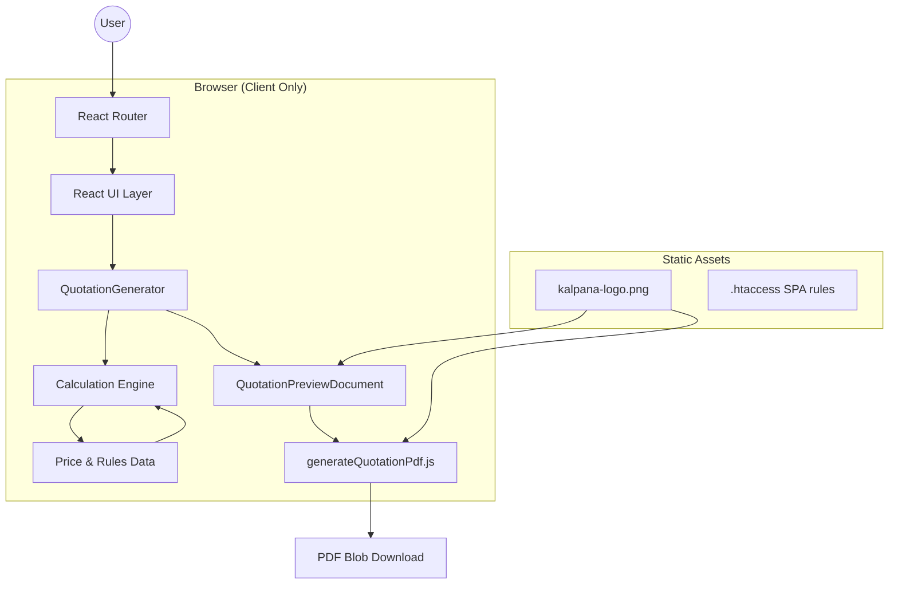
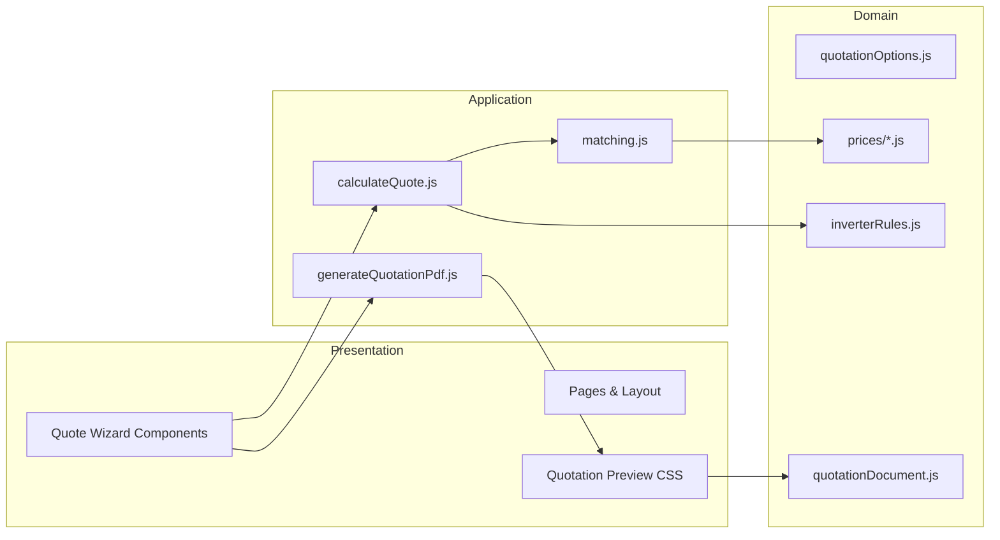
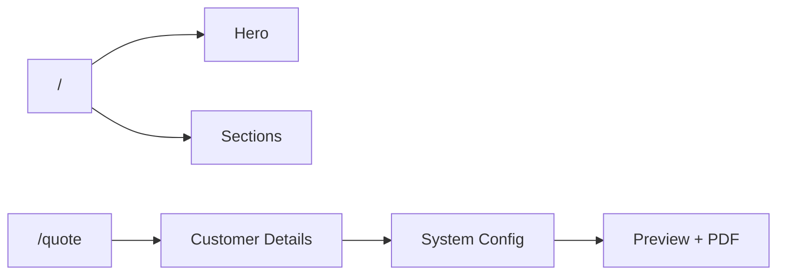
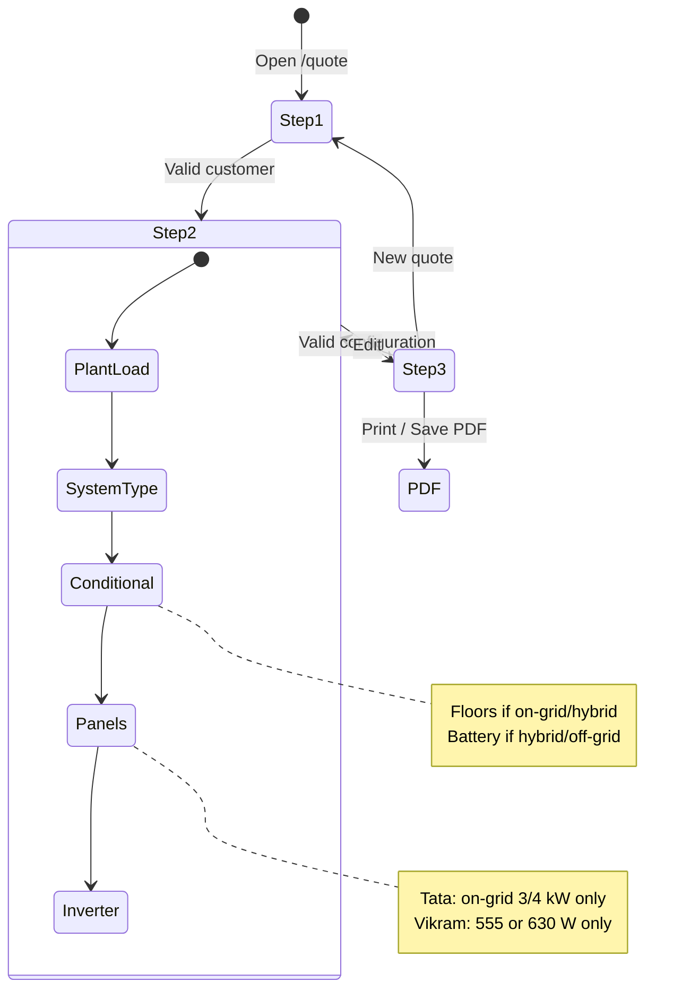
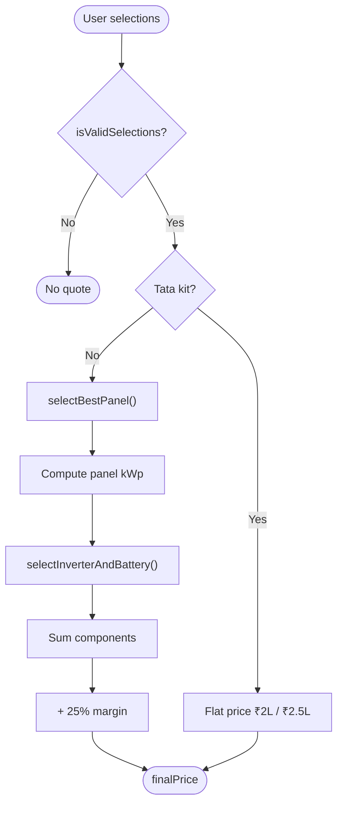
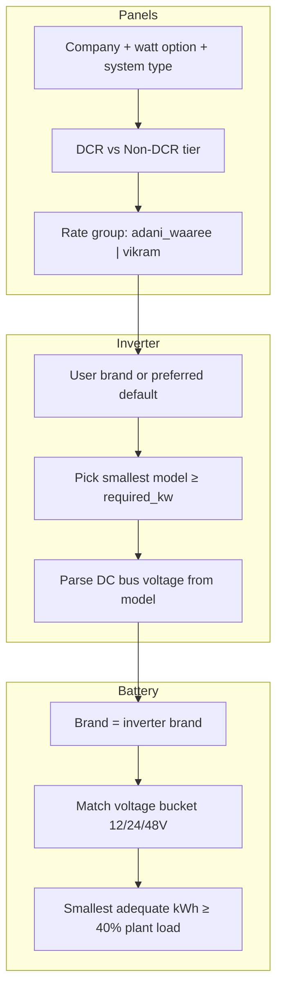
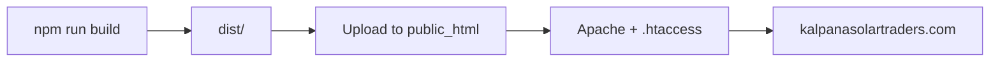

# Kalpana Solar Traders — Web Platform & Quotation Engine

A production-ready marketing website and **client-side solar quotation system** for **Kalpana Solar Traders** (Kanpur, Uttar Pradesh). The application lets sales staff collect customer details, configure a rooftop solar system, compute an equipment-matched price from official supplier rate sheets, and export a **4-page professional PDF proposal**.

> **Business domain:** Residential & commercial solar EPC — on-grid, hybrid, and off-grid systems using Adani, Waaree, Vikram, Premier, and Tata panel lines, with Invergy and Microtek inverters.

---

## Table of Contents

1. [Executive Summary](#executive-summary)
2. [Features](#features)
3. [Technology Stack](#technology-stack)
4. [System Architecture](#system-architecture)
5. [Application Routes](#application-routes)
6. [Quotation Wizard Flow](#quotation-wizard-flow)
7. [Pricing Engine](#pricing-engine)
8. [Equipment Matching](#equipment-matching)
9. [PDF Generation Pipeline](#pdf-generation-pipeline)
10. [Project Structure](#project-structure)
11. [Configuration & Data Sources](#configuration--data-sources)
12. [Getting Started](#getting-started)
13. [Build & Deployment](#build--deployment)
14. [Business Rules Reference](#business-rules-reference)
15. [Known Limitations](#known-limitations)
16. [Related Documentation](#related-documentation)

---

## Executive Summary

| Attribute | Detail |
|-----------|--------|
| **Client** | Kalpana Solar Traders |
| **Location** | Kanpur Nagar, Uttar Pradesh |
| **Application type** | Single-page application (SPA) |
| **Primary workflow** | 3-step quotation wizard → live preview → PDF download |
| **Pricing model** | Component-based costing + **25% margin** (except Tata flat kits) |
| **Backend** | None — all logic runs in the browser |
| **Hosting target** | Apache / cPanel (`public_html`) |

The codebase separates **presentation** (React components), **business rules** (`src/data/prices/`), **calculation logic** (`src/calculations/`), and **document content** (`src/data/quotationDocument.js`) so rate-sheet updates do not require UI changes.

---

## Features

### Marketing Website (`/`)

- Responsive landing page with hero, services, product catalog overview, brand partners, value proposition, and contact section
- Shared layout: navbar, footer, brand-aligned Tailwind v4 styling
- Client-side routing via React Router

### Quotation Wizard (`/quote`)

- **Step 1 — Customer:** name, phone, address, city
- **Step 2 — System configuration:** plant load, installation type, system type, conditional fields (floors, battery), panel company, module wattage, inverter brand
- **Step 3 — Preview & PDF:** 4-page A4 quotation document with live price, edit/back, print/save PDF

### Intelligent Form Behaviour

- **Conditional fields** based on system type (wiring floors, battery yes/no)
- **Tata kit** appears only for **On-Grid 3 kW / 4 kW**
- **Vikram / Premier** limited to **555 W (DCR)** or **630 W (off-grid)** — no 590 W Topcon option
- **Preferred inverter brand** highlighted per client rules; customer may override
- **Battery brand** auto-follows inverter brand (lithium only)
- Real-time **estimated price** on Step 2 when the form is valid

### Quotation Document (PDF)

- Page 1: Branded cover (kWp, system type, customer)
- Page 2: Project overview, KPIs, pricing, executive summary, commercial offer
- Page 3: Full bill of materials (BOM)
- Page 4: Warranty, payment schedule, bank details, terms, signatures

---

## Technology Stack

| Layer | Technology | Version |
|-------|------------|---------|
| UI framework | React | 19.x |
| Build tool | Vite | 8.x |
| Styling | Tailwind CSS | 4.x |
| Routing | React Router DOM | 7.x |
| PDF capture | html2canvas | 1.4.x |
| PDF assembly | jsPDF | 4.x |
| Language | JavaScript (ES modules) | — |
| Linting | ESLint | 10.x |

**Design choices:**

- **No backend / database** — simplifies deployment on shared hosting; all supplier prices live in version-controlled JS modules
- **Separation of data and UI** — price lists are plain exports, not embedded in components
- **Iframe + style inlining for PDF** — avoids Tailwind v4 `oklch()` colour parsing failures in html2canvas
- **jsPDF logo compositing** — logos are stamped after page capture for reliable rendering

---

## System Architecture

### High-Level Architecture



### Layer Responsibilities



---

## Application Routes

| Route | Page | Layout |
|-------|------|--------|
| `/` | Marketing homepage | Navbar + Footer |
| `/quote` | Quotation wizard | Full-screen (no navbar/footer) |



Apache `mod_rewrite` serves `index.html` for all non-file routes so deep links like `/quote` work on cPanel hosting.

---

## Quotation Wizard Flow



### Validation Gates

The **Generate Quotation** button stays disabled until `isValidSelections()` passes in `calculateQuote.js`. A quote returns `null` (no price) when:

- Required fields are missing
- Tata is selected outside On-Grid 3/4 kW
- No inverter in the catalog meets `required_kw`
- Battery is requested but no lithium model matches the inverter DC bus voltage

---

## Pricing Engine

### Calculation Pipeline



### Component Cost Formula (Standard Path)

| Component | Formula |
|-----------|---------|
| **Panels** | `total_watts × ₹/W (ex-GST) × 1.05` |
| **Inverter** | Catalog price + GST rules (see below) |
| **Battery** | Catalog price + GST rules (0 if no battery) |
| **Wiring** | On-grid: ₹3,000 × floors · Hybrid: ₹5,000 × floors |
| **Installation** | ₹2 × total panel watts |
| **Installation material** | Fixed ₹14,000 |
| **Civil work** | ₹400 × plant load kW |
| **Miscellaneous** | ₹5,000 + ₹5,000 (saman + labour) |

```
subtotal    = sum(all components)
margin      = round(subtotal × 0.25)
final_price = subtotal + margin
```

### GST Handling

| Supplier | Inverter GST | Battery GST |
|----------|--------------|-------------|
| **Microtek** | 5% added on ex-GST list price | 18% added on ex-GST list price |
| **Invergy** | MSP is **GST-inclusive** — no extra GST | MSP is **GST-inclusive** — no extra GST |
| **Panels** | 5% on ex-GST ₹/W rate | — |

### Panel Sizing

```
target_watts  = plant_load_kw × 1000
panel_count   = ceil(target_watts / watt_per_panel)
total_watts   = panel_count × watt_per_panel
panel_kwp     = total_watts / 1000
required_kw   = max(plant_load_kw, panel_kwp)
```

Wattage options are priced at the **maximum** of each range (e.g. 580–590 Wp → **590 W**).

---

## Equipment Matching



### Inverter Brand Preferences (UI default)

| System Type | Preferred Brand |
|-------------|---------------|
| On-Grid (residential) | **Invergy** |
| Hybrid ≤ 3 kW | **Microtek** |
| Hybrid > 3 kW | **Invergy** |
| Off-Grid ≤ 4 kW | **Microtek** |
| Off-Grid > 4 kW | **Invergy** |

Both brands remain selectable; the preferred option is visually highlighted.

### Panel Company × Watt Availability

| Company | On-Grid / Hybrid (DCR) | Off-Grid (Non-DCR) |
|---------|--------------------------|---------------------|
| Adani, Waaree | 555, 590, 630 W | 630 W only |
| Vikram, Premier | **555 W only** | 630 W only |
| Tata | Kit (no watt picker) | Not offered |

---

## PDF Generation Pipeline

```mermaid
sequenceDiagram
    participant User
    participant Preview as QuotationPreviewDocument
    participant Capture as generateQuotationPdf
    participant H2C as html2canvas
    participant PDF as jsPDF

    User->>Preview: Step 3 visible
    User->>Capture: Print / Save PDF
    Capture->>Capture: Load logo as data URL
    Capture->>Capture: Enable quote-pdf-capture-mode
    loop Each of 4 pages
        Capture->>Capture: Clone page → iframe
        Capture->>Capture: Inline RGB styles (skip oklch)
        Capture->>H2C: Rasterize A4 (794×1123 px)
        H2C-->>Capture: Canvas PNG
        Capture->>PDF: addImage(full page)
        Capture->>PDF: stampPdfLogos (cover/header/footer)
    end
    PDF-->>User: Blob download
```



**Implementation notes (`PDF_CAPTURE_VERSION = 5`):**

- Each `.quote-preview-page` maps 1:1 to one A4 PDF page
- Logos are **hidden during html2canvas** and drawn with `jsPDF.addImage()` to avoid image rendering bugs
- Logo asset is **bundled** via Vite (`src/assets/kalpana-logo.png`) for reliable fetch
- Executive summary uses **single column** during capture to prevent overlap glitches
- PDF blob is cached per quote reference until selections change

---

## Project Structure

```
kalpana-solar/
├── public/
│   ├── .htaccess              # SPA routing + cache headers (copied to dist/)
│   ├── kalpana-logo.png       # Legacy public copy (bundled copy in src/assets)
│   └── icons.svg
├── src/
│   ├── main.jsx               # React entry
│   ├── App.jsx                # Router definition
│   ├── index.css              # Tailwind imports
│   │
│   ├── pages/
│   │   ├── HomePage.jsx       # Marketing landing
│   │   └── QuotePage.jsx      # Wizard shell
│   │
│   ├── components/
│   │   ├── Layout.jsx         # Navbar/Footer wrapper
│   │   ├── QuotationGenerator.jsx   # 3-step wizard orchestrator
│   │   ├── Hero.jsx, Services.jsx, Products.jsx, …
│   │   ├── quote/
│   │   │   ├── CustomerStep.jsx
│   │   │   ├── PreviewStep.jsx
│   │   │   ├── QuotationPreviewDocument.jsx   # 4-page A4 document
│   │   │   ├── QuoteDocLogo.jsx
│   │   │   └── QuoteWizardHeader.jsx
│   │   └── ui/
│   │       └── Logo.jsx
│   │
│   ├── calculations/
│   │   ├── calculateQuote.js  # Validation, breakdown, margin, Tata path
│   │   └── matching.js        # Panel / inverter / battery selection
│   │
│   ├── data/
│   │   ├── quotationData.js   # Re-exports for components
│   │   ├── quotationOptions.js
│   │   ├── quotationDocument.js   # BOM, terms, company info, salutation
│   │   ├── quotationDesign.js     # PDF layout helpers & KPI estimates
│   │   ├── formatCurrency.js
│   │   └── prices/
│   │       ├── panels.js        # ₹/W rates, watt options, company rules
│   │       ├── microtek.js      # Jaganlite inverter catalog
│   │       ├── invergy.js       # Invergy MSP catalog
│   │       ├── batteries.js     # Lithium models per brand
│   │       ├── inverterRules.js # Brand preference & eligibility
│   │       ├── services.js      # Wiring, labour, civil, margin
│   │       ├── taxes.js         # GST helpers
│   │       └── tata.js          # Flat kit pricing
│   │
│   ├── styles/
│   │   ├── brand.css
│   │   └── quotation-preview.css
│   │
│   ├── utils/
│   │   └── generateQuotationPdf.js
│   │
│   └── assets/
│       ├── brandLogo.js
│       └── kalpana-logo.png
│
├── dist/                      # Production build output (deploy this)
├── QUOTATION_LOGIC.md         # Detailed business-rules verification guide
├── vite.config.js
├── package.json
└── README.md
```

---

## Configuration & Data Sources

| Data | Source File | Supplier / Notes |
|------|-------------|------------------|
| Panel ₹/W (DCR / Non-DCR) | `panels.js` | Kalpana rate sheet |
| Microtek inverters | `microtek.js` | Jaganlite (W.E.F. Jun 2026), ex-GST |
| Invergy inverters | `invergy.js` | Invergy MSP (Oct 2025), GST-inclusive |
| Lithium batteries | `batteries.js` | Microtek + Invergy official lists |
| Tata kits | `tata.js` | 3 kW ₹2,00,000 · 4 kW ₹2,50,000 |
| BOM & legal text | `quotationDocument.js` | Kalpana quotation template |
| Company / bank details | `quotationDocument.js` | Kalpana Solar Traders |

**To update prices:** edit the relevant file under `src/data/prices/`, run `npm run build`, redeploy `dist/`.

**To replace the logo:** update `src/assets/kalpana-logo.png`, bump `LOGO_CACHE_VERSION` in `src/assets/brandLogo.js`, rebuild.

---

## Getting Started

### Prerequisites

- **Node.js** 18+ (20+ recommended)
- **npm** 9+

### Installation

```bash
git clone <repository-url>
cd kalpana-solar
npm install
```

### Development Server

```bash
npm run dev
```

Open the URL shown in the terminal (typically `http://localhost:5173`).

| URL | Purpose |
|-----|---------|
| `/` | Marketing site |
| `/quote` | Quotation wizard |

### Lint

```bash
npm run lint
```

### Production Preview (local)

```bash
npm run build
npm run preview
```

---

## Build & Deployment

### Build

```bash
npm run build
```

Output is written to `dist/`:

```
dist/
├── index.html
├── .htaccess
└── assets/
    ├── index-<hash>.js
    ├── index-<hash>.css
    └── kalpana-logo-<hash>.png
```

### Deploy to cPanel / Apache

1. **Delete** the old `public_html/assets/` folder (avoid stale hashed bundles).
2. Upload **all contents** of `dist/` to `public_html/`.
3. Confirm `.htaccess` is present (enables SPA routing and cache busting on `index.html`).
4. Hard-refresh the browser (**Ctrl+Shift+R**) after deploy.
5. Verify deployment: view page source — the `index-*.js` hash should match the uploaded file.



### Cache Behaviour

| Asset | Cache policy |
|-------|--------------|
| `index.html` | No cache — always fetch latest |
| `assets/*.{js,css,png}` | Long cache (content-hashed filenames) |

---

## Business Rules Reference

The following rules are enforced in both the **UI** and **calculation layer**:

| Rule | Behaviour |
|------|-----------|
| Plant load | 1–10 kW integers only |
| On-grid / hybrid panels | DCR tier |
| Off-grid panels | Non-DCR Topcon 630 W |
| Tata kit | On-grid 3 kW or 4 kW only; flat price, no margin |
| Inverter sizing | `max(plant_load, panel_kwp)` |
| Battery | Lithium only; brand follows inverter |
| Salutation | `MR/MRS.{NAME}` when no prefix entered |
| BOM highlights | Havells/Polycab DC 4 mm, AC armoured 10 mm, earthing 16 mm ×3, rod 1 m ×3 |

For exhaustive worked examples, GST edge cases, and verification checklists, see **[QUOTATION_LOGIC.md](./QUOTATION_LOGIC.md)**.

---

## Known Limitations

| Scenario | Result |
|----------|--------|
| Microtek hybrid 3 kW + battery | 48 V bus → only 5.12 kW battery in catalog |
| Microtek off-grid 7.5 kW+ MPPT (96 V / 120 V) + battery | No matching lithium battery → quote fails |
| Off-grid wiring cost | Not priced (`pricePerFloor: null` in `services.js`) |
| PDF generation | Requires Step 3 preview visible in DOM; large pages rely on capture-mode CSS tightening |
| Backend / CRM sync | Not implemented — quotes exist only in the browser session |

---

## Related Documentation

| Document | Description |
|----------|-------------|
| [QUOTATION_LOGIC.md](./QUOTATION_LOGIC.md) | Full pricing, matching, and PDF verification guide with worked examples |
| `src/data/quotationDocument.js` | Official BOM items, payment terms, warranty, bank details |
| `src/data/prices/` | Machine-readable supplier price catalogs |

---

## Company Information

**Kalpana Solar Traders**  
31, Naubasta Hamirpur Road, Metro Pillar No.111  
(Opp. Basant Vihar Police Chowki), Kanpur Nagar — 208021  

**Contact:** 9839908349 · 8736992133 · 8400195212  
**Email:** kalpanasolartraders@gmail.com  
**GSTIN:** 09BBDPY7262HIZ3  
**MSME:** UDYAM-UP-43-017950  

---

## License

Proprietary — developed for Kalpana Solar Traders. All rights reserved.
